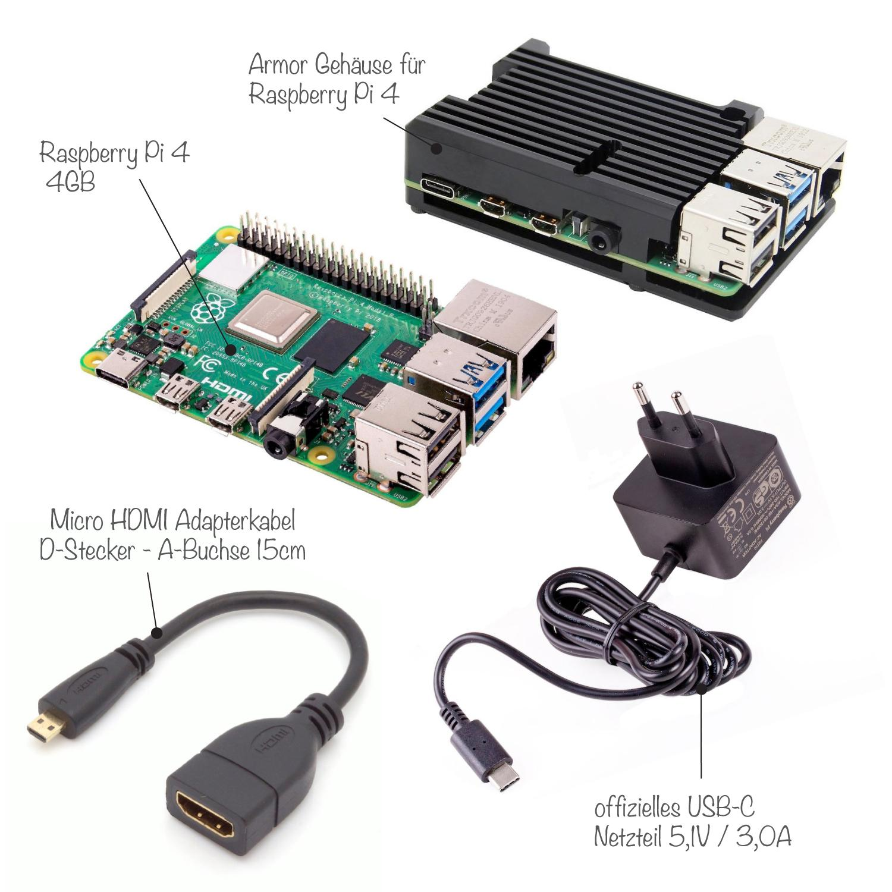

:::::::::::::::::::::::::::::::::::::: questions 

- Was ist Datenmanagement?
- Was ist digitale Selbstbestimmtheit?
- Warum ist eine selbst gehostete Datenmanagementlösung gut?

::::::::::::::::::::::::::::::::::::::::::::::::

::::::::::::::::::::::::::::::::::::: objectives

- Thematische Einleitung
- Vorstellung der Ziele und Inhalte des Kurses
- Voraussetzungen, die Sie mitbringen sollten
- Informationen zum Ablauf des Kurses

::::::::::::::::::::::::::::::::::::::::::::::::

## Thematische Einleitung

### Datenmanagement im wissenschaftlichen Kontext

Der Begriff des Forschungsdatenmanagements (FDM) umschreibt den Umgang mit Forschungsdaten (z.B. Messdaten, Bilder, Artikel, Interviewdaten u.v.m.) innerhalb von Forschungsprojekten. Dabei beginnt FDM bei der Planung von Projekten, legt Standards für das Erstellen, Analysieren und Publizieren fest und sorgt durch strukturierte Archivierung für eine nachhaltige Speicherung und die Möglichkeit der Nachnutzung der Forschungsdaten.

Mehr zum Thema FDM finden Sie z.B. [hier](https://uni-tuebingen.de/de/240762), [hier](https://forschungsdaten.info/) oder im Kurs [FDM Basics](https://dr-eberle-zentrum.github.io/FDM-basics/)

Um während der aktiven Forschungsarbeit seine Daten strukturiert und zugänglich speichern zu können und mit anderen Projektteilnehmenden kollaborieren zu können, sind online Dateispeicherung und online Dateibearbeitung essentiell.

Häufig werden hierfür die Angebote großer Tech-Konzerne aus dem Ausland genutzt. Es gibt aber auch die Möglichkeit solche Lösungen selbst zu betreiben. Dadurch ist der Datenschutz gewährleistet, da keine Daten außerhalb der EU gespeichert werden. Außerdem ist man unabhängig von den vermeintlich günstigen Angeboten der Tech-Konzerne.

Die Probleme, die eine solche Abhängigkeit auch im privaten Alltag herbeiführen, erfahren Sie in der folgenden Aufgabe. 

::::::::::::::::::::::::::::::::::::: challenge 

### Aufgabe 1: Mark und sein Sohn

- Lesen Sie den folgenden Artikel: [SPIEGEL: Autoupload in die Google-Cloud](https://www.spiegel.de/netzwelt/netzpolitik/google-vater-fotografiert-genitalbereich-von-krankem-kleinkind-und-der-aerger-beginnt-a-b0703d5e-7109-4271-bfa7-af07b551e105)

- Welche grundlegenden Probleme führten zu Marks Situation?

:::solution
In diesem Fall ist einiges schief gelaufen. Wir werden darüber in der ersten Präsenzsitzung diskutieren. 

Auf jeden Fall hat Mark jedoch seine informationelle Selbstbestimmung aufgegeben.
:::

::::::::::::::::::::::::::::::::::::::::::::::::

### Informationelle Selbstbestimmtheit

Unter dem Begriff *informationelle Selbstbestimmtheit* wird verstanden, dass Personen selbst über ihre Daten bestimmen können. Das [Bundesverfassungsgericht](https://www.bverfg.de/e/rs19831215_1bvr020983.html) hat dazu bereits 1983 geurteilt:

> "Das Grundrecht gewährleistet insoweit die Befugnis des Einzelnen, grundsätzlich selbst über die Preisgabe und Verwendung seiner persönlichen Daten zu bestimmen."

**Aber wie können wir selbst über die Preisgabe unserer Daten bestimmen?**

### Digitale Mündigkeit

Um selbst über seine Daten zu bestimmen, sollte man die Daten und deren Zustandenkommen verstehen. D.h. angewendete Technik sollte verstanden und hinterfragt werden. Stimmt etwas nicht, sollte Kritik geübt werden oder ggf. nach Alternativen gesucht werden. Fragen Sie sich beim Einsatz digitaler Tools immer:

- Welche Daten gibt es?

- Wann entstehen welche Daten?

- Wer hat Zugriff auf diese Daten?

- Welche Daten möchte ich wem preis geben und welche behalte ich für mich?

::::::challenge
### Wie digital mündig sind Sie?

Lesen Sie den folgenden Artikel von [Digitalcourage](https://digitalcourage.de/digitale-selbstverteidigung/digitale-muendigkeit) 

Welche der im Artikel genannten Punkte setzen Sie bereits um? In welchen Bereichen können Sie noch "mündiger" werden?

:::solution
Nutzen Sie ein kostenloses E-Mailpostfach? Speichern Sie Daten in verdächtig günstigen Onlinespeichern? Wie abhängig sind Sie von Big Tech (Apple, Google, Amazon, Microsoft)?
:::
::::::

Mehr zum Thema digitale Mündigkeit findet sich auch bei Simon 2024 [^1]

[^1]: L. Simon, Digitale Mündigkeit - Wie wir mit einer neuen Haltung die Welt retten können, (Bielefeld 2024)

:::testimonial
### Digitale Selbstbestimmtheit
Zu einem selbstbestimmten Leben gehört auch eine digitale Selbstbestimmtheit. 

Deshalb:

 - eingesetzte Technik verstehen

 - Open-Source statt Closed Source

 - Community statt Großkonzern
:::

### Noch mehr zu digitaler Selbstbestimmtheit und Selbstverteidigung

Noch mehr Informationen zum Thema finden Sie bei Interesse unter anderem bei den folgenden Quellen:

- [Seminar zur digitalen Selbstverteidigung](https://github.com/Dr-Eberle-Zentrum/Digitale-Selbstverteidigung)

- E. Snowden, Permanent Record - Meine Geschichte, (Berlin 2019)

- J. Caspar, Wir Datensklaven - Wege aus der digitalen Ausbeutung, (Berlin 2023)

- [Digitalcourage](https://www.digitalcourage.org)

- [Netzpolitik](https://www.netzpolitik.org)

- [ChaosComputerClub](https://www.ccc.de) und [Streams des CCC](https://media.ccc.de/)

## Ziele und Inhalte des Kurses

### Allgemeine Ziele

- Einstieg die Linux-(Server)-Welt

- Weniger Angst vor Technik (und Fehlern)

- Einstieg in die Systemadministration

- Einrichten einer selbst betriebenen Cloudanwendung zur Dateiverwaltung mit dem Raspberry Pi

### Inhaltliche Schwerpunkte

- **Betriebssystem: Installation und grundlegende Verwaltung:**

Wir beginnen ganz am Anfang mit der Installation dem Kennenlernen des Linux-Betriebssystems. Wir nutzen dazu das Betriebssystem [Raspberry Pi OS](https://www.raspberrypi.com/software/operating-systems/#raspberry-pi-os-64-bit), welches wiederum auf dem Debian-Betriebssystem aufbaut. Mehr dazu in der zweiten Woche.

{alt='Screenshot auf welchem das Programm Raspberry Pi Imager mit Funktionen zur Auswahl eines Betriebssystems zu sehen ist.'}

- **Sicherheit: Backup, Firewall, Fern-Zugriff:**

Vor der Installation der eigentlichen Cloud-Software muss der Server eingerichtet werden. Dazu zählen z.B. Funktionen zum Fernzugriff (SSH), verschiedene Techniken zum Absichern des Servers (Firewall, Benutzer und Zugriffsrechte) aber auch das Thema Backup.

{alt='Drei Screenshot von Kommandozeilen. Der erste zeigt einen Befehl zum herstellen einer SSH-Verbindung, der zweite den rsync-Befehl zum erstellen von Backups und der dritte den Befehl zur erlauben von SSH-Verbindungen in der Firewall.'}

- **Netzwerktechnik: Router, Portweiterleitungen, DDNS:**

Wir werden uns damit beschäftigen, wie der Server, der Zuhause im Wohnzimmer steht, weltweit im Internet erreichbar gemacht werden kann. Dafür müssen wir uns mit Begriffen Dynamic Domain Name System (DDNS), Portweiterleitung, Firewall, NAT, IPv4, IPv6 und weiteren auseinandersetzen.

{alt='Screenshot, der dieAdministrationsoberfläche eines Fritzbox-Routers zeigt. Konkret sind Funktionen zum einrichten von Portweiterleitungen zu sehen.'}

- **Webserver und Cloudserver**

Sobald der Server grundlegend eingerichtet ist und die sichere Erreichbarkeit im Internet gewährleistet ist, werden wir uns an die Installation und Konfiguration des Webservers (Apache2) und des Cloudservers ([Nextcloud](https://nextcloud.com)) machen. Der Webserver kann gewissermaßen als Kommunikationszentrale zwischen Cloudserver und Internet betrachtet werden. Beim Cloudserver handelt es sich um die Software, die für die Dateiverwaltung zuständig ist und mit welcher wir am Ende unsere Dateien betrachten, synchronisieren, freigeben und bearbeiten wollen.

{alt='Zu sehen sind zwei Screenshots. Links ein Screenshot einer Konfigrationsdatei einer Website für den Apache2-Webserver und rechts die Browser-Administrationsoberschläche des Cloudservers Nextcloud.'}

- Ausblick

Sofern am Ende des Kurses noch Zeit verfügbar ist, schauen wir uns noch ein paar andere Projekte an, die ebenfalls auf einem Raspberry Pi betrieben werden können. Denn es gibt sehr viele Dinge, die man selbst betreiben kann (auf einem Rasperry Pi oder ggf. größerer Hardware). Auf Github gibt es eine große [Liste mit Projekten](https://github.com/awesome-selfhosted/awesome-selfhosted). 

{alt='Zu sehen sind vier Bilder. Von links nach rechts: Logo des Radicale-Projekts in Form eines Radieschens, Logo de Pi-hole-Projekts in Form einer abstrahierten Himbeere, Logo des KODI-Projekts als auf der Spitze stehendes balues Quadrat und zuletzt ein Screenshot aus dem Programm MotionEye, welcher verschiede Einstellungsparameter fpr eien Kamera zeigt sowie eine Momentaufnahme der Kamera, die ein Fenster von außen überwacht.'}

## Voraussetzungen

### Allgemeine Voraussetzungen

- Sie sollten sicher mit Ihrem PC (Windows oder Linux) oder Ihrem Mac umgehen können

- Sie sollten keine Angst vor Technik und der Kommandozeile haben

- Sie sollten ein Notebook mit administrativen Rechten haben.

### Technische Voraussetzungen

Für die Teilnahme am Kurs wird ein Raspberry Pi Set benötigt. Entweder Sie nutzen dafür Ihre **eigene Hardware** oder Sie **leihen** eines von max. 15 Sets aus.

Das Raspberry Pi Set besteht mindestens aus den folgenden Komponenten:

- Raspberry Pi 4 oder 5 mit min. 4 GB RAM (besser 8 GB)

- USB-C-Netzteil

- SDHC-Karte (ca. 16 GB)

- Adapterkabel Micro-HDMI auf HDMI

- Kühlkörper ggf. mit Lüfter (v.a. beim Raspberry Pi 5 sind aktive Lüfter empfehlenswert)

- Tastatur und Maus

{alt=''}

**Zusätzlich** zum Raspberry Pi Set ist folgendes nötig:

- 1 Patch-Kabel (LAN-Kabel) zum Anschluss des Raspberry Pi am Router

- Zugriff auf die Administrationsoberfläche Ihres Routers

- Freie Netzwerkbuchse am Router bzw. Switch (notfalls auch WLAN)

- einen Monitor/Fernseher mit HDMI-Eingang

- Aufstellplatz mit Strom- und Netzwerkversorgung

- Leerer USB-Stick oder leere externe Festplatte mit eigener Stromversorgung

## Organisatorisches

### Wöchentlicher Ablauf:

Die Wochen laufen i.d.R. wie folgt ab:

1. Sie arbeiten das Lernmaterial auf [Github][github] durch

2. Sie absolvieren auf [ILIAS][ilias] den Test zum Selbstlernmaterial

3. Sie setzen die Arbeitsschritte selbstständig mit Ihrem Raspberry Pi um. Dazu können Sie (online oder in Präsenz) zum Übungstermin kommen.

### Gruppenarbeit

Um die prkatische Umsetzung des Projekts zu erleichtern, werden im Kurs Gruppen gebildet. Nutzen Sie diese Gruppen, um Fragen zu klären, das praktische Vorgehen gemeinsam zu planen und bei Problemen gemeinsam nach Lösungen zu suchen.

### Leistungsnachweis

- Bei erbrachter Leistung erhalten Sie für diesen Kurs 3 ECTS-Punkte zunächst ohne Note oder auf expliziten Wunsch mit Note.

- Der Kurs ist anrechenbar für das Zertifikat *[Data Literacy](https://uni-tuebingen.de/de/180835)* im Wahlbereich praktische Anwendungen

- Die erforderliche Leistungen sind:

  - wöchentliche Bearbeitung der Lernmaterialien

  <!-- wöchentlicher Test auf [ILIAS][ilias] -->
  
  - Abgabe von fünf Protokollen im Laufe des Vorlesungszeit
  
  - selbstständige Konfiguration eines Cloud-Servers
  
  - Verfassen eines Abschlussberichts (ca. 3-4 Seiten)
  
- Der Workload beträgt entsprechend 3 ECTS ca. 90 Stunden im Semester. Davon entfallen ca. 21 Stunden auf die Präsenzsitzungen, 9 Stunden auf den Abschlussbericht und 60 Stunden auf die Vor- und Nachbereitung der Sitzungen inkl. den Protokollen. D.h. pro Woche müssen Sie während der Vorlesungszeit durchschnittlich ca. 4,3 Stunden Arbeitszeit zusätzlich zu den Präsenzsitzungen einplanen.

**Mehr Informationen folgen in der ersten Präsenzsitzung.**

::::::::::::::::::::::::::::::::::::: keypoints 

- Die eigene Cloud schützt die Privatsphäre und reduziert die Abhängigkeit von großen Monopolisten
- Der Kurs begleitet Sie vom Hardwaresetup und dem Linux Betriebssystem über die Grundkonfiguration des Servers bis hin zur Installation und Konfiguration des eigenen Cloudservers
- Sie müssen jede Woche Selbstlernmaterial durcharbeiten, auf ILIAS einen Test durchführen und die praktischen Aufgaben absolvieren
- Am Ende des Kurses müssen Sie noch einen Abschlussbericht verfassen
- Für den Kurs erhalten Sie 3 ECTS-Punkte

::::::::::::::::::::::::::::::::::::::::::::::::

