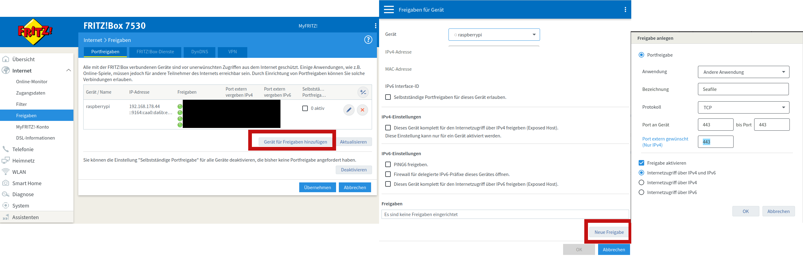

:::::::::::::::::::::::::::::::::::::: questions 

- Wie kann ich meinen Raspberry Pi im Internet erreichen?

- Wie erhalte ich einen Domainnamen/eine URL für meinen Server?

- Wie ermögliche ich Zugriff vom Internet in mein Heimnetzwerk?

::::::::::::::::::::::::::::::::::::::::::::::::

::::::::::::::::::::::::::::::::::::: objectives

- Router: Schnittstelle zwischen Internet und Heimnetz

- DDNS: dynamische IP-Adressen mit fixen Domainnamen

- Portweiterleitungen einrichten

::::::::::::::::::::::::::::::::::::::::::::::::

## Externe Erreichbarkeit

Aktuell befindet sich der Raspberry Pi in einem Heimnetzwerk. Dort ist er mit einem Router verbunden. Dieser Router ist mit dem Netzwerk des Internetanbieters verbunden, welches wiederum eine Verbindung "ins Internet" hat. Das folgende Schaubild zeigt den aktuellen Aufbau:

{alt='Diese Abbilung zeigt den Aufbau eines Heimnetzwerks. Zu sehen sind ein Computer mit der IP-Adresse 192.168.178.26. Dieser ist mit einem Router mit der IP-Adresse 192.168.178.1 verbunden. Am Router ist ein Raspberry Pi angeschlossen, dieser hat die IP-Adresse 192.168.178.25. Der Router ist mit dem Internet verbunden und hat die externe IP-Adresse 93.236.170.179'}

::::::challenge
### Externe Erreichbarkeit
Sie kennen nun das aktuelle Netzwerksetup. Ihr Raspberry Pi hat auch eine Internetverbindung und mit Ihrem PC können Sie z.B. per SSH auf Ihren Raspberry Pi zugreifen. Aber wie ist der Raspberry Pi aus dem Internet erreichbar?

1. Unter 192.168.178.25

2. Unter 93.236.170.179

3. Er ist gar nicht erreichbar

4. Unter 192.168.178.1
:::solution
- Antwort 3 ist die richtige

Da der Router aktuell keine Anfragen von außen nach innen durchlässt, ist das Heimnetzwerk nicht aus dem Internet erreichbar. Der Router selbst ist dagegen unter der Adresse 93.236.170.179 erreichbar, wird aber aus Sicherheitsgründen nicht auf Anfragen antworten.
:::

::::::

### Portweiterleitung

Damit der Router Anfragen aus dem Internet annimmt und an ein Gerät im Heimnetz weiterleitet, muss dem Router mitgeteilt werden, welche Art von Anfragen (auf welchem Port) er annehmen soll und an welches Gerät (welche MAC-Adresse) diese weitergeleitet werden sollen. Die entsprechenden Einstellungen variieren von Gerät zu Gerät. Häufig heißen die entsprechenden Funktionen *Portforwarding*, *Portweiterleitungen* oder *Freigaben*. Nicht jeder Router unterstützt diese Funktionalität. Insbesondere die günstigen Heimrouter, die Internetprovider zur Verfügung stellen sind hier häufig in Ihrer Funktionalität eingeschränkt.

Zu beachten ist auch, dass manche Internetanbieter das DS-Lite-Verfahren nutzen. Dabei teilt sich der eigene Router ein Netzwerk (und damit eine öffentliche IP-Adresse) mit anderen Kunden des Internetanbieters. Das macht es (nahezu) unmöglich, den Router aus dem Internet zu erreichen. Eine Abbhilfe kann hier das IPv6-Protokoll sein, da hier nicht der Router die öffentliche IP-Adresse erhält, sondern jedes einzelne Gerät eine weltweit einzigartige IPv6-Adresse hat und somit direkt im Internet erreichbar sein kann.

### DDNS: Dynamic domain name system

Auch wenn die Portweiterleitung erfolgreich ist und der Router anfragen aus dem Internet annimmt und an den Raspberry Pi weiterleitet, so ist der Router (und damit der Raspberry Pi) noch immer unter seiner IP-Adresse erreichbar. Diese ist jedoch schwer zu merken und ändert sich für Privatkunden in der Regel auch einmal täglich aufgrund einer nächtlichen Zwangstrennung durch den Internetanbieter. Wer einen Dienst (in unserem Fall den Nextcloud-Server) stets unter derselben Adresse erreichen will, kann dazu auf das dynamic domain name system (kurz: **DDNS**) zurück greifen.

DDNS funktioniert unter zuhilfenahme eines externen Dienstleisters. Bei diesem wird eine (Sub)Domain beantragt, z.B. *server.dns-anbieter.de*. Auf dem Raspberry Pi kann nun das Programm **DDClient** installiert werden. Dieses wiederum frägt regelmäßig einen Internetseite an und lässt sich von dieser die eigene öffentliche IP-Adresse mitteilen. Dadurch erfährt DDClient, unter welcher Adresse der Raspberry Pi erreichbar ist und ob sie sich geändert hat. Diese Adresse schickt DDClient nun an den DDNS-Anbieter, bei welchem die eigene Domain beantragt wurde. Dieser wiederum trägt die IP-Adresse in seinem DNS (DNS ist eine Art Telefonbuch des Internets, in welchem IP-Adresse in Domainnamen übersetzt werden) ein. Dadurch wird ein Computer, der die Adresse *server.dns-anbieter.de* ansteuert, vom DDNS-Anbieter die tagesaktuelle öffentliche IP-Adresse des Heimnetzwerks erhalten und kann seine Anfrage dann dorthin schicken.

Es gibt verschiedene Anbieter für DDNS-Dienste. Gut geeignet sind z.B. [No-IP](www.noip.com) oder [DDNSS](https://www.ddnss.de/). Auch viele Heimrouter bieten über den Hersteller eine Möglichkeit für DDNS (z.B. AVM mit Fritz.Box-Routern).

### Umsetzung DDNS am Raspberry Pi

## Apache Webserver installieren

### Installation und Verzeichnisse

### Test der externen Erreichbarkeit

::::::::::::::::::::::::::::::::::::: keypoints 

- 

::::::::::::::::::::::::::::::::::::::::::::::::

