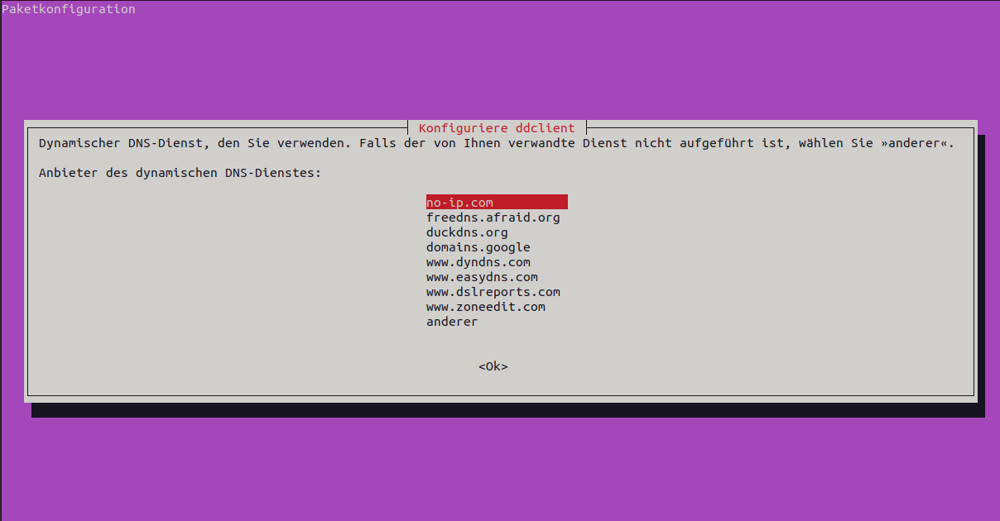
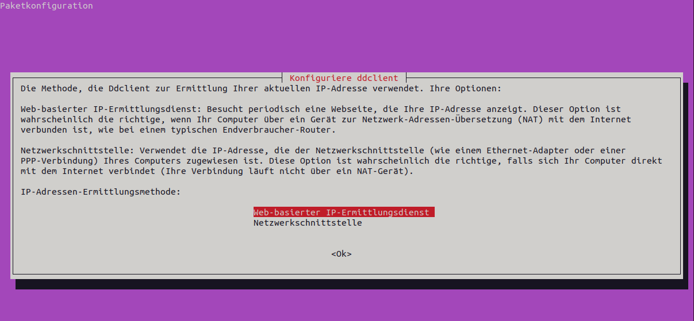

:::::::::::::::::::::::::::::::::::::: questions 

- Wie kann ich meinen Raspberry Pi im Internet erreichen?

- Wie erhalte ich einen Domainnamen/eine URL für meinen Server?

- Wie ermögliche ich Zugriff vom Internet in mein Heimnetzwerk?

::::::::::::::::::::::::::::::::::::::::::::::::

::::::::::::::::::::::::::::::::::::: objectives

- Portweiterleitungen am Router einrichten

- DDNS: eigene URL trotz dynamischer IP-Adressen

- Webserver im Heimnetzwerk betreiben

::::::::::::::::::::::::::::::::::::::::::::::::

## Externe Erreichbarkeit

Aktuell befindet sich der Raspberry Pi in einem Heimnetzwerk. Dort ist er mit einem Router verbunden. Dieser Router ist mit dem Netzwerk des Internetanbieters verbunden, welches wiederum eine Verbindung "ins Internet" hat. Das folgende Schaubild zeigt den aktuellen Aufbau:

{alt='Diese Abbilung zeigt den Aufbau eines Heimnetzwerks. Zu sehen sind ein Computer mit der IP-Adresse 192.168.178.26. Dieser ist mit einem Router mit der IP-Adresse 192.168.178.1 verbunden. Am Router ist ein Raspberry Pi angeschlossen, dieser hat die IP-Adresse 192.168.178.25. Der Router ist mit dem Internet verbunden und hat die externe IP-Adresse 93.236.170.179'}

::::::challenge
### Externe Erreichbarkeit
Sie kennen nun das aktuelle Netzwerksetup. Ihr Raspberry Pi hat auch eine Internetverbindung und mit Ihrem PC können Sie per SSH auf Ihren Raspberry Pi zugreifen. Aber wie ist der Raspberry Pi aus dem Internet erreichbar?

1. Unter 192.168.178.25

2. Unter 93.236.170.179

3. Er ist gar nicht erreichbar

4. Unter 192.168.178.1

:::solution
- Antwort 3 ist die richtige

Da der Router aktuell keine Anfragen von außen nach innen durchlässt, ist das Heimnetzwerk nicht aus dem Internet erreichbar. Würde der Router Anfragen durchlassen, wären sämtlich Geräte im Heimnetzwerk im Internet exponiert und gefährdet. Der Router selbst ist dagegen unter der Adresse 93.236.170.179 erreichbar, wird aber aus Sicherheitsgründen nicht auf Anfragen antworten.
:::

::::::

### Portweiterleitung

Damit der Router bestimmte Anfragen aus dem Internet annimmt und an ein bestimmtes Gerät im Heimnetzwerk weiterleitet, muss dem Router mitgeteilt werden, welche Art von Anfragen (auf welchem Port) er annehmen soll und an welches Gerät (welche MAC-Adresse) diese weitergeleitet werden sollen. Die entsprechenden Einstellungen variieren von Gerät zu Gerät. Häufig heißen die entsprechenden Funktionen *Portforwarding*, *Portweiterleitungen* oder *Freigaben*. Nicht jeder Router unterstützt diese Funktionalität. Insbesondere die günstigen Heimrouter, die Internetprovider kostenlos zur Verfügung stellen sind hier häufig in Ihrer Funktionalität eingeschränkt.

{alt=''}

Zu beachten ist auch, dass manche Internetanbieter das DS-Lite-Verfahren (Dual  Stack Lite) nutzen. Dabei teilt sich der eigene Router ein Netzwerk (und damit eine öffentliche IP-Adresse) mit anderen Kunden des Internetanbieters. Das macht es (nahezu) unmöglich, den Router aus dem Internet zu erreichen. Eine Abbhilfe kann hier das IPv6-Protokoll sein, da hier nicht der Router die öffentliche IP-Adresse erhält, sondern jedes einzelne Gerät eine weltweit einzigartige IPv6-Adresse hat und somit direkt im Internet erreichbar sein kann.

### DDNS: Dynamic domain name system

Der Router nimmt nun anfragen aus dem Internet an und leitet diese an den Raspberry Pi weiter. Der Router (und damit der Raspberry Pi) ist aber bislang nur unter seiner IP-Adresse erreichbar. Diese ist jedoch schwer zu merken und ändert sich für Privatkunden in Deutschland in der Regel einmal täglich aufgrund einer nächtlichen Zwangstrennung durch den Internetanbieter. Wer einen Dienst (hier ein Nextcloud-Server) stets unter derselben Adresse und einer URL erreichen will, kann dazu auf das dynamic domain name system (kurz: **DDNS**) zurück greifen.

DDNS funktioniert unter Zuhilfenahme eines externen Dienstleisters. Bei diesem wird eine (Sub)Domain beantragt, z.B. *server.dns-anbieter.de*. Auf dem Raspberry Pi kann das Programm **DDClient** installiert werden. Dieses kontaktiert regelmäßig eine Internetseite und erhält von dieser die eigene öffentliche IP-Adresse als Echo zurück. Dadurch erfährt DDClient, unter welcher IP-Adresse der Raspberry Pi erreichbar ist und ob diese sich geändert hat. Diese IP-Adresse schickt DDClient an den DDNS-Anbieter, bei welchem die eigene Domain beantragt wurde. Dieser Anbieter wiederum trägt die IP-Adresse in seinem DNS ein.

:::callout
### DNS
**DNS** kann als Telefonbuch des Internets verstanden werden, in welchem IP-Adressen in Domainnamen übersetzt werden, z.B. wird die IP-Adresse 49.13.55.174. in [wikipedia.de](https://wikipedia.de) übersetzt. Mehr zum Thema DNS findet sich z.B. beim [Elektronikkompendium](https://www.elektronik-kompendium.de/sites/net/0901141.htm).
:::

Ruft ein Computer die Adresse *server.dns-anbieter.de* auf, wird im DNS des DDNS-Anbieters die tagesaktuelle öffentliche IP-Adresse des Heimnetzwerks ausgelesen und übermittelt. Dadurch wird die Anfrage an die richtige IP-Adresse geschickt.

Es gibt verschiedene Anbieter für DDNS-Dienste. Gut geeignet sind z.B. [No-IP](https://noip.com) oder [DDNSS](https://www.ddnss.de/). Auch viele Heimrouter bieten über den Hersteller eine Möglichkeit für DDNS an (z.B. AVM mit Fritz.Box-Routern).

### Umsetzung DDNS am Raspberry Pi

Für die Implementierung des DDNS-Verfahrens am Raspberry Pi wird wie folgt vorgegangen:

- Account bei einem DDNS-Anbieter registrieren

- Im Falle von *No-IP* muss im [Webportal](https://noip.com) des Anbieters ein Benutzername festgelegt werden

- Beim gewählten Anbieter muss ein Domainname reserviert werden (A-Record für IPv4 oder AAAA-Record für IPv6)

- ddclient auf dem Raspberry Pi installieren und konfigurieren: `sudo apt-get install ddclient`

    - Im Anschließenden Dialog wird im Falle von No-IP *no-ip* gewählt, ansonsten *anderer*
    
    - als Benutzername und Passwort werden die Zugangsdaten des DDNS-Anbieters eingetragen
    
    - als *IP-Adressen-Ermittlungsmethode* wird *Web-basierter IP-Ermittlungsdienst* gewählt
    
    - der zu aktualisierende Rechner ist der beim DDNS-Anbieter reservierte Domainnamen
    
{alt='Konfigurationsdialog von DDClient. Es stehen mehrere DDNS-Anbieter zur Auswahl. Hervorgehoben ist no-ip.com'}    

{alt='Konfigurationsdialog von DDClient: festlegen der IP-Ermittlungsmethode, hervorgehoben ist die Option web-basierter IP-Ermittlungsdienst'}

{alt='Konfigurationsdialog von DDClient: eingabe des Domainnamens, als Platzhalter ist server.ddns-anbieter.de zu sehen'}    

Nach der Installation sollte die **Konfigurationsdatei** überprüft und ggf. angepasst werden: `sudo nano /etc/ddclient.conf`. Je nach DDNS-Anbieter sieht die Konfigurationsdatei unterschiedlich aus.

- DDNSS.de:

```bash
#für ddnss.de
protocol=dyndns2
use=web, web=https://api.ipify.org/ 
server=ddnss.de
login=<DDNSSLoginName>
password='<Passwort>'
<domainname>.ddnss.de
```

- NO-IP:

```bash
#NO-IP.com
protocol=noip
use=web, web=http://ip1.dynupdate.no-ip.com/
login=<noip-username>
password=’<noip-passwort>’
<noip-Domainname>
```

::::::challenge
### Externe Erreichbarkeit
Sie haben die Portweiterleitung am Router und die DDNS-Konfiguration am Raspberry Pi abgeschlossen. Wie ist der Raspberry Pi nun aus dem Internet erreichbar?

1. Unter 192.168.178.25

2. Unter 93.236.170.179

3. Er ist nach wie vor nicht erreichbar

4. Unter server.ddns-anbieter.de

:::solution
- Antwort 3 ist die richtige

Zwar ist das Heimnetzwerk nun unter der DDNS-Domain (im Beispiel server.ddns-anbieter.de) erreichbar, der Router lässt Anfragen von Außen nach Innen durch und leitet sie auch an den Raspberry Pi weiter. Dessen **Firewall** blockiert aber aktuell noch alle Verbindungen außer der SSH-Verbindung, weshalb die Anfrage wieder nicht ans Ziel gelangt.
:::

::::::

### Firewall anpassen

Um Zugriffe auf Ressourcen des Raspberry Pi zu erlauben (z.B. HTTP und HTTPS-Verkehr für einen Webserver), muss dessen Firewall angepasst werden. Um zu testen, ob die Kommunikation grundlegend funktioniert, wird zunächst der Port 80 für unverschlüsselten HTTP-Datenverkehr geöffnet, sowohl als Portweiterleitung am Router, als auch in der Firewall des Raspberry Pi. Am Raspberry Pi wird dazu der UFW-Befehl genutzt: `sudo ufw allow 80`

## Apache Webserver installieren

Noch wird am Raspberry Pi kein Dienst auf Anfragen mit Port 80 reagieren. Um die Kommunikation zu testen wird der Webserver *Apache2* installiert, der auch im weiteren Projektverlauf genutzt wird: `sudo apt-get install apache2`

### Installation und Verzeichnisse

Nach der Installation sind bereits einige Konfigurationsverzeichnisse vorhanden:

- Virtual-Host-Konfiguration: für jede Internetseite, die der Apache-Webserver ausliefern soll, wird eine Konfigurationsdatei unter `/etc/apache2/sites-available` erstellt. Zu Beginn befindet sich dort bereits die Apache-Standard-Konfigurationsdatei, welche zum testen genügt.

- Website-Daten: die Dateien (z.B. die HTML-Dokumente) der Website selbst liegen im sogenannten *Document-Root*, welches Standardmäßig unter `/var/www/html/`zu finden ist, aber für jede Internetseite individuell angepasst werden kann (in der Virtual-Host-Konfigurationsdatei).

- Log-Dateien: Log-Dateien des Apache-Webservers finden sich meistens unter `/var/log/apache2/`. Der Pfad kann aber in der Virtual-Host-Datei angepasst werden.

### Test der externen Erreichbarkeit

Da der Apache-Webserver nach der Installation bereits eine Standardwebsite zu Verfügung stellt, kann die Erreichbarkeit des Webserver direkt getestet werden. Dabei empfiehlt es sich, den Test Stück um Stück zu eskalieren:

- 1. Stufe: Erreichbarkeit vom Raspberry Pi selbst testen: in der Kommandozeile mit `curl localhost` (als Antwort wird ein HTML-Dokument auf der Kommandozeile ausgegeben) oder mit verbundenem Bildschirm im Browser durch Eingabe von localhost in der Adresszeile. Funktioniert Stufe 1, ist gewährleistet, dass der Apache-Webserver funktionert.

- 2. Stufe: Erreichbarkeit im Heimnetzwerk: Lokale IP-Adresse des Raspberry Pi (im Beispiel die 192.168.178.25) in der Adresszeile des Browsers am PC/Notebook eingeben. Es sollte die Apache Standardseite zurück geliefert werden. Funktioniert Stufe 2, ist gewährleistet, dass der Zugriff auf den Webserver nicht von der Raspberry Pi Firewall blockiert wird (zunmindest nicht aus dem Heimnetzwerk heraus).

- 3. Stufe: Erreichbarkeit im Internet: gewählte DDNS-Domain (im Beispiel server.ddns-anbieter.de) am Smartphone ohne WLAN-Verbindung aufrufen. Es solte dasselbe Ergebnis wie in Stufe 2 erreicht werden. Funktioniert auch Stufe 3, ist gewährleistet, dass sowohl die DDNS-Konfiguration funktioniert, als auch die Portweiterleitung.

Schlägt eine der Stufen fehl, muss zuerst nach dem Fehler gesucht werden. Vermutlich liegt es an einer Fehlerhaften Konfiguration der Firewall, der Portweiterleitung oder von DDClient.

::::::::::::::::::::::::::::::::::::: keypoints 

- Um den Raspberry Pi aus dem Internet zu erreichen müssen mehrere Schritte unternommen werden.

- es muss eine DDNS-Domain reserveriert werden und ein DDNS-Dienst auf dem Raspberry Pi konfiguriert werden.

- es muss eine Portweiterleitung auf dem Router des Heimnetzwerks eingerichtet werden. Dies muss vom Internetanbieter unterstützt werden.

- die Firewall des Raspberry Pi muss angepasst werden.

::::::::::::::::::::::::::::::::::::::::::::::::

