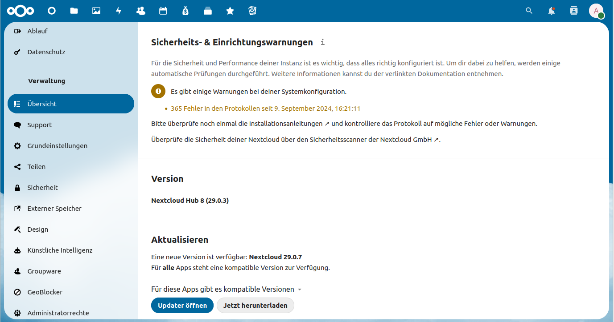

:::::::::::::::::::::::::::::::::::::: questions 

- Wie installiere ich Nextcloud?

- Wie kann ich die Installation anpassen?

- Wie kann die Leistung optimiert werden?

::::::::::::::::::::::::::::::::::::::::::::::::

::::::::::::::::::::::::::::::::::::: objectives

- Nextcloud im Webbrowser installieren

- Nextcloud im Browser verwalten

- Nextcloud über die CMD verwalten

- Caching konfigurieren

::::::::::::::::::::::::::::::::::::::::::::::::

## Installation

Nachdem in den vorhergehenden Lektionen die Installationsdateien heruntergeladen und jetzt durch Apache über eine HTTPS-Verbindung zur Verfügung gestellt werden, kann die eigentliche Installation beginnen. Dazu ruft man die eigene Domain im Webbrowser auf. Dort wird der Installationsassistent von Nextcloud ("Installation wizard") erreicht.

Im Assistenten muss ein **Adminstrator-Konto** für Nextcloud mit Username und Passwort angelegt werden. Es müssen außerdem die Zugangsdaten für die in [Lektion 9](09-installationsvorbereitung-3.Rmd) erstellte **Datenbank** eingegeben werden. Da auch das **Datenverzeichnis** in einem angepassten Pfad auf dem externen Speicher liegen soll (z.B. `/mnt/data/ncdata`), muss auch der Standardpfad für das Datenverzeichnis angepasst werden.

Mehr zum Installationsassistenten findet sich im [Handbuch](https://docs.nextcloud.com/server/stable/admin_manual/installation/installation_wizard.html).

## Konfiguration

Nach der Installation kann und sollte die Nextcloudinstanz weiter konfiguriert werden, um das System zu optimieren und seinen Bedürfnissen anzupassen. Dafür bietet Nextcloud drei unterschiedliche Möglichkeiten an, die teilweise dieselben Konfigurationsmöglichkeiten anbieten, teilweise aber auch unterschiedliche.

- Konfiguration über die Weboberfläche

- Konfiguration auf der Kommandozeile mit dem OCC-Tool

- Konfiguration in der Datei `/var/www/nextcloud/config/config.php`

### Weboberfläche

Meldet man sich in der Weboberfläche mit dem bei der Installation erstellten Administrator-Account an, können in den Verwaltungseinstellungen (erreichbar bei Klick auf das User-Icon in der rechten oberen Ecke) verschiedene administrative Tätigkeiten vorgenommen werden, sowie Fehlermeldungen und Systemberichte eingesehen werden.

{alt='Screenshot, welcher die Weboberfläche eines Nextcloud-Servers zeigt. Zu sehen ist darauf das geöffnete Kontextmenü nach Klick auf das Usericon. Der Maus-Cursor zeigt auf den Punkt "Verwaltungseinstellungen'}

In der Übersicht der Verwaltungseinstellungen werden Warnmeldungen und Installationsprobleme angezeigt. Diese Warn- und Fehlermeldungen sollten direkt nach der Installation ausführlich untersucht und behoben werden. Dabei hilft meistens schon die Fehlermeldung als solches, das Handbuch oder eine Internetrecherche weiter. 

Ebensfalls wird in der Übersicht die aktuelle Version angezeigt und auf evtl. vorhandene Aktualisierungen hingewiesen.

{alt='Screeshot der die Übersicht der Verwaltungseinstellungen zeigt. Zu sehen sind die Punkte "Sicherheits- und Einrichtungswarnungen", "Version" und "Aktualisieren"'}

Sind alle Installationsfehler behoben, kann der Reiter *Grundeinstellungen* betrachtet werden. Da Nextcloud im Hintergrund regelmäßig verschiedene Aufgaben durchführt (z.B. Dateiscans, Prüfung auf Aktualsierungen oder Papierkorbleerungen), muss ein Tool für das Ausführen dieser Aufgaben festgelegt werden. Hierfür wird *cron* empfohlen. Mit *cron* können auf Linuxsystemen Aufgaben (sog. Cron-Jobs) definiert und zu bestimmten Zeitpunkten ausgeführt werden. Dafür muss ein Eintrag in der Crontabelle des Users angelegt werden, welcher die Aufgabe ausführen soll. Für die Erstellung des Cronjobs für Nextcloud, wird die Crontabelle des www-data-Users mit dem Befehl `sudo crontab -u www-data -e` bearbeitet und folgender Eintrag ergänzt: `*/5  *  *  *  * php -f /var/www/nextcloud/cron.php` Siehe dazu auch das [Handbuch](https://docs.nextcloud.com/server/latest/admin_manual/configuration_server/background_jobs_configuration.html#cron)

Als weiterer Punkt der Grundeinstellungen empfiehlt es sich, einen E-Mail-Server zu definieren, über welchen der Nextcloud-Server Benachrichtungen verschicken kann. Dazu müssen die Zugangsdaten eines Postausgangsservers (SMTP) angegeben werden. Für E-Mailadressen der Universität Tübingen lassen sich die Einstellungen im [Wiki des ZDV](https://faq.zdv.uni-tuebingen.de/otrs/public.pl?Action=PublicFAQZoom;ItemID=29) nachlesen. Zu beachten ist, dass die Zugangsdaten im Klartext in der Nextcloud-Konfigurationsdatei (`/var/www/nextcloud/config/config.php`) stehen.

### occ-Tool

Zwar kann in der Weboberfläche schon einiges eingestellt werden, häufig müssen Operationen aber über die Kommmandozeile erledigt werden. Dafür steht das nextcloudintegrierte Programm *occ* zur Verfügung. Die Nutzung des Programms ist im [Handbuch](https://docs.nextcloud.com/server/latest/admin_manual/configuration_server/occ_command.html) ausführlich beschrieben. In unserem Setup kann es wie folgt aufgerufen werden: `sudo -u www-data php /var/www/nextcloud/occ <occ-Befehl>` Dabei steht eine Vielzahl an Befehlen zur Verfügung, die im Handbuch beschrieben sind. Um z.B. ein Upgrade zu starten lautet der Befehl `sudo -u www-data php /var/www/nextcloud/occ upgrade` (Details siehe [hier](https://docs.nextcloud.com/server/latest/admin_manual/configuration_server/occ_command.html#command-line-upgrade-label)). Häufig müssen nach einem Upgrade auch [Einträge in der Datenbank](https://docs.nextcloud.com/server/latest/admin_manual/configuration_server/occ_command.html#database-add-indices-label) angepasst werden: `sudo -u www-data php /var/www/nextcloud/occ db:add-missing-indices`

### Konfigurationsdatei

Eine Weitere Möglichkeit der Konfiguration stellt die Konfigurationsdatei `/var/www/nextcloud/config/config.php` dar. Diese kann mit dem nano-Editor direkt bearbeitet werden. Allerdings ist hierbei stets auf die korrekte PHP-Syntax zu achten. Wird das occ-Tool genutzt, kümmert sich dieses um die Änderung der Konfigurationsdatei. Allerdings sind nicht alle Konfigurationswerte durch eigene occ-Befehle implementiert, weshalb die occ-Befehle für manche Anpassungen komplex werden und das direkte Editieren der Datei einfacher erscheint.

## Caching

Bei jedem Aufruf der Nextcloud-Website werden im Hintergrund Prozesse gestartet (z.B. Skripte ausgeführt) und Dateien bereitgestellt. Um das Laden der Seite zu beschleunigen, ist es empfehlenswert einen Caching-Dienst zu nutzten. Dieser speichert einmal bereitgestellte Dateien oder Skripte für einen gewissen Zeitraum zwischen, wodurch diese bei erneutem Abruf schneller zur Verfügung stehen.

Nextcloud bietet unterschiedliche Caching-Implementationen an. Je nachdem, wie groß der eigene Server ist, werden unterschiedliche [Lösungen empfohlen](https://docs.nextcloud.com/server/latest/admin_manual/configuration_server/caching_configuration.html). Im Kurs nutzen wir die Lösung für [Organisationen mit einzelnem Server](https://docs.nextcloud.com/server/latest/admin_manual/configuration_server/caching_configuration.html#organizations-with-single-server).

### Umsetzung: 

- Caching-Dienst Redis und dessen PHP-Erweiterungen installieren: `sudo apt install redis-server php-redis php-apcu`

- Nextloud-Konfigurationsdatei ergänzen: `sudo nano /var/www/nextcloud/config/config.php`

```php
'memcache.local' => '\OC\Memcache\APCu',
'memcache.distributed' => '\OC\Memcache\Redis',
'memcache.locking' => '\OC\Memcache\Redis',
’redis’ => [
  ’host’ => ’/var/run/redis/redis-server.sock’,
  ’port’ => 0,
  ’timeout’ => 0.0,
],
```

- Redis Konfigurationsdatei anpassen: `sudo nano /etc/redis/redis.conf`

```
#[...]
port 0
#[...]
unixsocket /var/run/redis/redis-server.sock
unixsocketperm 770
```

- PHP anpassen: In `/etc/php/8.2/cli/php.ini` und `/etc/php/8.2/apache2/php.ini` folgende Angabe ergänzen:

```
apc.enable_cli=1
```

- Berechtigungen für UNIX-Socket-Datei anpassen: `sudo usermod -a -G redis www-data`

- Dienste neu starten: `sudo systemctl restart apache2 && sudo systemctl restart redis-server`

::::::::::::::::::::::::::::::::::::: keypoints 

- Die Installation von Nextcloud kann im Webbrowser erfolgen

- Im Anschluss an die Installation muss das System auf Fehler überprüft werden

- Die Konfiguration des Servers kann im Browser, mit dem occ-Programm oder mit der Konfigurationsdatei erfolgen

- Für eine bessere Leistung empfiehlt sich die Implementierung eines Caching-Dienstes

::::::::::::::::::::::::::::::::::::::::::::::::

