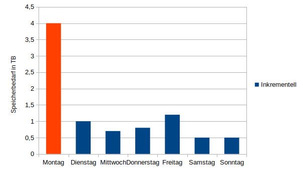

:::::::::::::::::::::::::::::::::::::: questions 

- Was ist beim Thema Backup zu beachten?

- Muss ich meinen Nextcloud-Server sichern?

- Wie kann ich eine Backupstrategie aufsetzen?

::::::::::::::::::::::::::::::::::::::::::::::::

::::::::::::::::::::::::::::::::::::: objectives

- Grundlagen zum Thema Backup lernen

- Anwendung der Grundlagen auf das eigene System

- Erstellen und ausführen von Skripten

- Cronjobs zur automatischen Skriptausführung nutzen

::::::::::::::::::::::::::::::::::::::::::::::::

## Grundlagen

Bereits in [Kapitel 7](07-installationsvorbereitung-1.Rmd) wurde auf die Notwendigkeit eines Backups eingegangen und die gesamte Festplatte (bzw. SD-Karte) gesichert. Dadurch besteht eine Möglichkeit, jederzeit den Stand zum Zeitpunkt von Kapitel 7 wiederherzustellen. Auch jetzt ist es empfehlenswert, ein Backup des gesamten Systems zu erstellen.

Im laufenden Betrieb eignet sich das Sichern des gesamten Systems weniger, da einerseits ein manuelles Eingreifen nötig ist und andererseits auch große Datenmengen anfallen. Deshalb wird in diesem Kapitel ein Verfahren aufgezeigt, welches es ermöglicht, im laufenden Betrieb automatisiert Backups zu erstellen.

### Was muss gesichert werden?

Welche Inhalte eines Systems gesichert werden sollen, ist von den eigenen Bedürfnissen abhängig. Es kann jedoch zwischen drei Hauptkategorien an Daten unterschieden werden:

- Dateien (Bilder,Dokumente, Videos, Emails...)

- Programme und Lizenzen (Installationsdateien, Konfigurationen, ganze Installationen)

- System (Betriebssystem mit (allen?) Konfigurationen)

In vielen Fällen wird die Sicherung der Dateien ausreichen, da Programme und System mit etwas Zeitaufwand wieder neu aufgesetzt werden können. In zeitkritischen Umgebungen, wenn ein defektes System schnell wieder verfügbar sein muss, empfiehlt es sich aber, dass gesamte System zu sichern.

### Wie muss gesichert werden?

Es kann zwischen drei Varianten einer Sicherung unterschieden werden:

- Vollsicherung

- Differentielle Sicherung

- Inkrementelle Sicherung

Bei der **Vollsicherung** werden zu jeder Sicherungszeit (z.B. täglich oder wöchentlich) alle Daten gesichert. Der Vorteil dieser Variante ist, dass für eine Wiederherstellung der Daten nur die letzte Sicherungsversion benötigt wird. Der Nachteil liegt im großen Speicher- und Zeitbedarf, da bei jeder Sicherung alle Daten kopiert werden müssen, also sowohl die ursprünglichen Daten, als auch die Daten, die seit der letzten Sicherung neu hinzugekommen sind.

{alt='Diagramm, welches für jeden Wochentag einen Wert für den Speicherbedarf der Vollsicherung in TB anzeigt. Montags werden 4 TB benötigt. Mit jeder weiteren Sicherung erhöht sich der Betrag um neu hinzugekommene Daten. Am Ende der Woche werden 8,5 TB benötigt'}

Bei der **differentiellen Sicherung** wird zur ersten Sicherungszeit eine Vollsicherung durchgeführt. Anschließend wird jeden Tag eine Sicherung erstellt, welche alle seit der letzten Vollsicherung geänderten oder neu erstellten Daten enthält. Der Vorteil dieser Variante besteht darin, dass bei einer Wiederherstellung nur die letzte Vollsicherung und die letzte differentielle Sicherung benötigt werden. Der Nachteil liegt wie bei der Vollsicherung darin, dass nach wie vor ein großer Speicherplatzbedarf besteht und die Daten dupliziert vorliegen.

{alt='Diagramm, welches für jeden Wochentag einen Wert für den Speicherbedarf der differentiellen Sicherung in TB anzeigt. Montags werden 4 TB benötigt. Dienstags wird nur 1 TB für neue Daten benötigt. Jede weitere Sicherung benötigt jeweils den Bedarf des Vortags plus neu hinzugekommen Daten. Am Wochenende beträgt der Bedarf 4,7 TB'}

Bei der **inkrementellen Sicherung** werden jeden Tag nur diejenigen Daten gesichert, die an diesem Tag geändert bzw. neu hinzugekommen sind. Der Vorteil der inkrementellen Variante besteht darin, dass vergleichsweise wenig Zeit und Speicherplatz benötigt wird, da nur zu Beginn eine Vollsicherung erstellt wird und zu jeder weiteren Sicherungszeit nur die Änderungen gesichert werden. Der Nachteil besteht darin, dass im Falle einer Wiederherstellung die letzte Vollsicherung und alle inkrementellen Zwischensicherungen benötigt werden.

{alt='Diagramm, welches für jeden Wochentag einen Wert für den Speicherbedarf der inkrementellen Sicherung in TB anzeigt. Montags werden 4 TB benötigt. Dienstags wird nur 1 TB für neue Daten benötigt. Jede weitere Sicherung benötigt nur den Bedarf der an diesem Tag neu hinzugekommen Daten.'}

Neben der Art der Sicherung, muss auch überlegt werden, wie die einzelnen Sicherungsversionen aufgehoben werden. Im obigen Beispiel zu einer täglichen inkrementellen Sicherung und einer wöchentlichen Vollsicherung können z.B. die Vollsicherung und die inkrementellen Zwischensicherungen nur solange aufgehoben werden, bis eine neue Vollsicherung erstellt wurde. Möchte man jedoch gewährleisten, auch auf einen Datenstand von vor 6 Monaten zurück gehen zu können, sollten die Sicherungen länger aufgehoben werden. Z.B. könnte dann eine monatliche Vollsicherung in jeweils sechs Versionen aufbewahrt werden. Wird eine siebte Version erstellt, wird die älteste gelöscht.

Ein bekanntes Schema zur Versionierung von Sicherungen ist das Generationenprinzip (auch als Großvater-Vater-Sohn-Prinzip bezeichnet). Bei diesem Prinzip werden täglich Backups erstellt. Diese werden eine Woche lang aufbewahrt. Anschließend werden die täglichen Versionen zu einem Wochenbackup zusammengefasst. Die wöchentlichen Backups werden für einen Monat aufbewahrt und nach einem Monat zu einer Monatssicherung zusammen gefasst. Diese monatlichen Sicherungen werden für 12 Monate aufbewahrt. Dadurch bestehen für die letzten sieben Tage jeweils tägliche Versionen, für den letzten Monat wöchentliche Versionen und für das letzte Jahr noch monatliche Versionen. Graphisch ist dieses Verfahren [hier](https://images.vogel.de/infodienste/smimagedata/1/4/1/6/5/9/53.jpg) dargestellt.

### Wo muss gesichert werden?

Ist geklärt, was und wie gesichert werden soll, muss noch geklärt werden, wo gespeichert werden soll. Grundlegend sollten Sicherungen nicht auf demselben physischen Datenträger wie die Originaldaten gespeichert werden. Die **3-2-1-Regel** gilt als ein guter Richtwert: 3 Kopien auf 2 unterschiedlichen Medien, 1 Offsite-Kopie. Speichert man auf unterschiedlichen Medien, hat man mehr Felxibilität bei der Wiederherstellung. Die Offsite-Kopie an einem anderen Ort wird wichtig, wenn am ursprünglichen Serverstandort ein größerer Schaden Eintritt (z.B. Feuer, Wasser, Kurzschluss oder Einbruch).

Mehr zum Thema Datensicherung findet sich z.B. auch bei [Ubuntuusers](https://wiki.ubuntuusers.de/Datensicherung/) oder bei [Netzwelt](https://www.netzwelt.de/sicherheit/backup/backup-arten-erklaert.html).

## Der eigene Backupplan

Die zuvor dargestellten Methoden und Standards sind nicht immer einfach umzusetzen. Das ist mit ein Grund dafür, dass in vielen Fällen keine Sicherungen gemacht werden, da der Aufwand für die Implementierung einer Sicherungsstrategie zu groß erscheint. Deshalb ist es insbesondere für Heimanwender und kleinere Organisationen mit wenig zeitkritischen Daten oftmals besser ein mittelmäßiges Backup zu haben als gar keines und dafür nicht alle der zuvor genannten Regeln zu befolgen.

::::::challenge
### Backup für den Nextcloud-Server

Überlegen Sie sich, wie Sie Ihren Nextcloud-Server sichern können. Was (welche Daten) sollten Sie sichern? Wie sichern Sie (mit welcher Variante)? Suchen Sie im Internet nach Programmen oder Workflows, um eine Nextcloud-Instanz zu sichern. Wo speichern Sie die Sicherungen?

:::solution
Das [Handbuch](https://docs.nextcloud.com/server/stable/admin_manual/maintenance/backup.html) listet die grundlegenden Schritte auf, um den Nextcloud-Server zu sichern: 1. das Konfigurationsverzeichnis unter `/var/www/nextcloud/config`, 2. das Datenverzeichnis, z.B. unter `/mnt/data/ncdata`, 3. der Theme-Folder unter `/var/www/nextcloud/themes` (nur wichtig wenn eigene Themes genutzt werden) und 4. die Nextcloud-Datenbank des MariaDB-Servers.

Sinnvollerweise wird man eine inkrementelle Sicherung wählen, um Zeit und Speicherplatz zu sparen. Während das Handbuch zwar die einzelnen manuellen Schritte aufzeigt (Maintanance-Modus aktivieren, Ordner mit rsync sichern, Datenbank mit mysqldump sichern) gibt es viele Tools mit denen Nextcloud gesichert werden kann. Z.B. [Borg-Backup](https://www.c-rieger.de/backup-mit-de-duplizierung/), [Duplicati](https://www.youtube.com/watch?v=7ZayfpZsgk0) oder die Nextcloud-integrierte [Backup-App](https://apps.nextcloud.com/apps/backup). Eine weitere Möglichkeit besteht im schreiben eines eigenen Skripts (eines Mini-Programms), welches leicht an die eigenen Bedürfnisse angepasst werden kann.

Die Sicherungen können zunächst auf einer zweiten Festplatte, die am Raspberry Pi eingebunden ist, gespeichert werden. Mehr Unabhängigkeit vom Hauptsystem erhält man, wenn man die Sicherung über das Netzwerk auf einem zweiten Gerät speichert. Das kann z.B. per [Netzlaufwerk im Heimnetz](https://wiki.ubuntuusers.de/Samba_Server/) geschehen oder per SSH auf entfernte Rechner ([medium.com](https://medium.com/@techfocuspro/raspberry-pi-remote-backup-ensuring-your-datas-safety-4b50848f4817) oder [bioslevel.com](https://bioslevel.com/article/backing-up-to-a-remote-server-with-ssh-and-rsync/)).
:::
::::::

## Backupscript erstellen

Eine verhältnismäßig simple Backup-Lösung für Nextcloud ist ein Bash-Skript, in welchem die Befehle aus dem Handbuch eingetragen werden und welches dann zeitgesteuert ausgeführt wird.

### Bash-Skripting

Ohne den Anspruch auf Vollständigkeit zu erheben sei kurz auf die absoluten Grundlagen des Bash-Skriptings eingegangen. Beim Bash-Skripting werden die Befehle, die man normalerweise nach einander auf der Kommandozeile tippt, gesammelt in eine Textdatei geschrieben, ein sogenanntes Bash-Skript. Dieses wird immer mit der Shebang bezeichneten Syntax in der ersten Zeile eingeleitet: `#!/bin/bash`

Anschließend können Befehle wie auf der Kommandozeile geschrieben werden, das Skript gespeichert und mit `sudo chmod ug+x` ausführbar gemacht werden.

Beispiel:

```bash
#!/bin/bash
# Das ist ein Kommentar. Der wird ignoriert
# Mit echo kann Text ausgegeben werden
echo Hallo Welt
# Mit touch kann eine neue Datei text.txt erstellt werden
touch text.txt
# mit find kann nach Dateien gesucht werden
find . text.*
# mit rm können Dateien gelöscht werden
rm text.txt
```

Bei Ubuntuusers findet sich ein [Skripting-Guide](https://wiki.ubuntuusers.de/Shell/Bash-Skripting-Guide_f%C3%BCr_Anf%C3%A4nger/) mit mehr Details

### Nextcloud-Backup mit Bash-Skript

Für einen Nextcloud-Server könnte ein Skript in den Grundzügen wie folgt aussehen (keine Garantie auf Korrektheit oder Vollständigkeit):

```bash
#!/bin/bash
# Backup-Zielverzeinis als Variable definieren
backup_dir='/mnt/data/backup_nextcloud'

# Backup-Quellen als Variable definieren
data_dir='/mnt/data/nextcloud/'
themes_dir='/var/www/nextcloud/themes' 
config_dir='/var/www/nextcloud/config'

#Zeitstempel als Variable
datetime="$(date +'%Y-%m-%d_%H-%M-%S')"

#Link zum letzten Backup definieren
latest_link="${backup_dir}/latest"

# Pfade erstellen
## Backup-Verzeichnis
if [ ! -d $backup_dir ]; then
    echo "erstelle Backupverzeichnis $backup_dir"
    mkdir $backup_dir
    
elif [ -d $backup_dir ]; then
    echo "$backup_dir existiert bereits"
fi    
##Unterverzeichnisse
    if [ ! -d "$backup_dir/data" ]; then
    	echo "erstelle Unterverzeichnis "Data""
    	mkdir "$backup_dir/data"
    elif [ -d "$backup_dir/data" ]; then
	echo " Unterverzeichnis "Data" existiert bereits"
    fi 
    if [ ! -d "$backup_dir/config" ]; then
    	echo "erstelle Unterverzeichnis "config""
    	mkdir "$backup_dir/config"
    elif [ -d "$backup_dir/config" ]; then
	echo " Unterverzeichnis "config" existiert bereits"
    fi
    if [ ! -d "$backup_dir/themes" ]; then
        echo "erstelle Unterverzeichnis "themes""
        mkdir "$backup_dir/themes"
    elif [ -d "$backup_dir/themes" ]; then
        echo " Unterverzeichnis "themes" existiert bereits"
    fi
    if [ ! -d "$backup_dir/databases" ]; then
    	echo "erstelle Unterverzeichnis "databases""
    	mkdir "$backup_dir/databases"
    elif [ -d "$backup_dir/databases" ]; then
	echo " Unterverzeichnis "databases" existiert bereits"
    fi
## Latest-Verzeichnis
if [ ! -d $latest_link ]; then
    echo "erstelle Latest-verzeichnis $latest_link"
    mkdir $latest_link
elif [ -d $latest_link ]; then
    echo "$latest_link existiert bereits"
fi

#Latest-Links erstellen
ln -s "${backup_dir}/data/${datetime}" "${latest_link}/data"
ln -s "${backup_dir}/config/${datetime}" "${latest_link}/config"
ln -s "${backup_dir}/themes/${datetime}" "${latest_link}/themes"

# Nextcloud in den Maintenance mode versetzen
sudo -u www-data php /var/www/nextcloud/occ maintenance:mode --on

# Inkrementelles Backup der Daten erstellen:
echo "trying backup data directory"
rsync -Aax --delete  "${data_dir}" \
    --link-dest "${latest_link}/data" \
     "${backup_dir}/data/${datetime}"

# Inkrementelles Backup des Konfigurationsverzeichnisses durchführen
rsync -Aax --delete --exclude 'ccnet.sock' "${config_dir}" \
    --link-dest "${latest_link}/config" \
    "${backup_dir}/config/${datetime}"

rsync -Aax --delete "${themes_dir}" \
    --link-dest "${latest_link}/themes" \
    "${backup_dir}/themes/${datetime}"

#Latest-Verweis aktualisieren
rm "${latest_link}/data"
rm "${latest_link}/config"
rm "${latest_link}/themes"

ln -s "${backup_dir}/data/${datetime}" "${latest_link}/data"
ln -s "${backup_dir}/config/${datetime}" "${latest_link}/config"
ln -s "${backup_dir}/themes/${datetime}" "${latest_link}/themes"

# create mysql database backup:
sudo mysqldump --single-transaction --default-character-set=utf8mb4 -h localhost nextcloud > "${backup_dir}/databases/"nextcloud-sqlbkp_`date +"%Y-%m-%d-%H-%M-%S"`.bak

# Maintenance mode beenden
sudo -u www-data php /var/www/nextcloud/occ maintenance:mode --off

#21 Tage alte Backups suchen und loeschen
find $backup_dir/data -maxdepth 1 -mtime +21 -type d -exec rm -rf {} +
find $backup_dir/config -maxdepth 1 -mtime +21 -type d -exec rm -rf {} +
find $backup_dir/themes -maxdepth 1 -mtime +21 -type d -exec rm -rf {} +
find $backup_dir/databases -maxdepth 1 -mtime +21 -type f -exec rm {} +
```

::::::challenge
### Backup-Skript lesen und verstehen
Schauen Sie sich das oben gezeigte Backup-Skript genau an. Können Sie verstehen, was dieses Skript macht? Welche Parameter müssen Sie anpassen, damit dieses Skript für Ihr Setup funktioniert? Was sind die essentiellen Befehle, die ausgeführt werden?

:::solution
Von oben nach unten macht das Skript folgendes:

Es werden Variablen für die Backupquelle, das Backupziel und die aktuelle Zeit definiert.

Es werden leere Verzeichnisse im Backupziel erstellt, sofern diese noch nicht vorhanden sind.

Es werden Links auf die aktuelle Backupversion erstellt.

Nextcloud wird mit dem occ-Tool in den maintanace-Modus versetzt.

Mit rsync werden die Datenverzeichnisse gesichert.

Mit mysqldump wird die Datenbank gesichert.

Mit dem occ-Tool wird der maintanance-Modus wieder verlassen.

mit dem find-Befehl werden Sicherungsversionen, die älter als 21 Tage sind, gelöscht.
:::
::::::

## Cron und Cronjobs

Hat man ein Skript erstellt, sollte dieses manuell getestet werden, indem es auf der Kommandozeile aufgerufen wird: `./skript.sh` Benötigen die Befehle im Skript sudo-Rechte, muss das Skript auch mit sudo-Rechten ausegführt werden (ACHTUNG: dann werden alle Befehle mit root-Rechten ausgeführt): `sudo ./skript.sh`

Ist der manuelle Test erfolgreich verlaufen, kann das Skript mittels Cron automatisch zu bestimmten Zeiten ausgeführt werden. Wie im vorherigen Kapitel zur Nextcloud-Konfiguration erwähnt, ist Cron ein Programm, mit welchem Befehle zu bestimmten Zeiten automatisch ausgeführt werden. Diese Befehle werden in der Crontabelle gespeichert. Jeder User des Betriebssystems hat eine eigene Crontabelle. Soll ein Befehl mit Root-Rechten ausgeführt werden, muss der Befehl in die Crontabelle des root-Accounts eingetragen werden, Befehle die durch den www-data-User ausgeführt werden sollen, gehören in dessen Cron-Tabelle.

Die Crontabelle eines Users kann wie folgt angezeigt werden: `sudo crontab -u <username> -l` Um die Tabelle zu ändern lautet der Befehl wie folgt: `sudo crontab -u <username> -e` 

Die Einträge für jeden Cron-Job (also jeden auszuführenden Befehl) sind wie folgt aufgebaut: Zeitangabe für die Ausführung und auszuführender Befehl. Die Zeitangaben erfolgt dabei in fünf einzelnen Einheiten: 1. Angabe der Minute (0-59), 2. Angabe der Stunde (0-23), 3. Angabe des Tages (1-31), 4. Angabe des Monats (1-12) und 5. Angabe des Wochentages (0-7).

Beispiel: um das Skript backup.sh im Verzeichnis `/home/administrator/` jeden Montag um 14:30 auszuführen lautet der Eintrag wie folgt:

```
30 14 * * 1 sh /home/administrator/backup.sh
```

Ist der Cronjob erstellt, muss überprüft werden, ob das Skript zur eingestellten Zeit tatsächlich läuft und das gewünschte Ergebnis liefert.

## Restore

Ein Backup ist nur hilfreich, wenn es auch wieder hergestellt werden kann. Deshalb sollte schon beim erstellen der Sicherung klar sein, wie die Daten im Ernstfall wieder hergestellt werden könnnen. Im Falle von Nextcloud können die Dateien im Backup-Verzeichnis gefunden werden. Von dort können die Dateien wieder an den Ursprungsort kopiert werden (z.B. mir rsync oder dem cp-Befehl). Die Datenbanksicherung kann wie folgt wieder hergestellt werden:

```sql
mysql -h localhost -u <username> -p<password> -e "DROP DATABASE nextcloud"
mysql -h localhost -u <username> -p<password> -e "CREATE DATABASE nextcloud CHARACTER SET utf8mb4 COLLATE utf8mb4_general_ci"
mysql -h localhost -u <username> -p<password> <db_name> < nextcloud-sqlbkp_2024-10-12-14-30-44.bak
```

Das Handbuch schildert den [Restore-Prozess](https://docs.nextcloud.com/server/stable/admin_manual/maintenance/restore.html) ebenfalls.


::::::::::::::::::::::::::::::::::::: keypoints 

- inkrementelle Backups sind speicherplatz- und zeitsparend

- besser ein mittelmäßiges Backup als gar kein Backup

- Per Bash-Skript und cron-Job kann der Nextcloud-Server automatisch gesichert werden

::::::::::::::::::::::::::::::::::::::::::::::::

