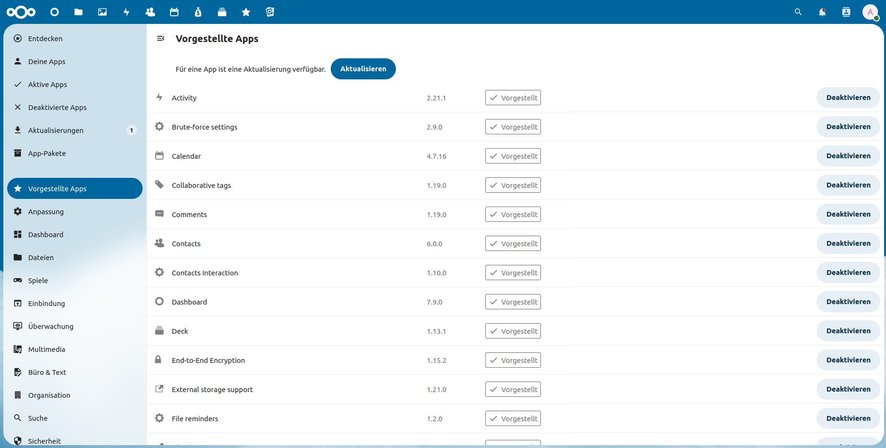

:::::::::::::::::::::::::::::::::::::: questions 

- Wie kann ich meinen Nextcloud-Server aktualisieren?

- Was kann ich noch für bessere Performance tun?

- Kann ich die Funktionalität erweitern?

::::::::::::::::::::::::::::::::::::::::::::::::

::::::::::::::::::::::::::::::::::::: objectives

- Upgrade im Browser und per CMD

- *Pretty URLs* konfigurieren

- Server Tuning: Mehr Leistung für das System

- Server Hardening: mehr Sicherheit für das System

- Apps und Integrationen

::::::::::::::::::::::::::::::::::::::::::::::::

## Nextcloud aktualisieren

Der gesamte Upgrade-Prozess ist im [Handbuch](https://docs.nextcloud.com/server/stable/admin_manual/maintenance/upgrade.html) ausführlich geschildert. Wie vor allen größeren Systemeingriffen, empfiehlt sich auch vor einem Upgrade ein Backup wie in [Kapitel 12](12-backup.Rmd) geschildert.

Ob eine neue Version verfügbar ist, kann der Übersicht in den Verwaltungseinstellungen entnommen werden (vgl. [Kapitel 11](11-konfiguration-1.Rmd)). Die Aktualisierung erfolgt in Abhängkeit des eigenen Systems auf unterschiedliche Weise. Im Falle der in diesem Kurs vorgenommenen manuellen Installation kann der *Built-in Updater* genutzt werden oder manuell durch Download der neuen Version das System aktualisiert werden. Im Folgenden wird der Built-in-Updater als empfohlene Variante genutzt.

Bei der Aktualisierung ist zwischen den unterschiedlichen Versionen zu differenzieren:

- Major release upgrade: 28.x zu 29.x

- Maintenance release upgrade 28.1 zu 28.2

- Point release upgrade: 28.1.0 zu 28.1.1

Insbesondere bei einem major release upgrade sollten zuvor die [Release Notes](https://docs.nextcloud.com/server/stable/admin_manual/release_notes/index.html#critical-changes) beachtet werden, um zu überprüfen, ob das Upgrade weitere Systemanpassungen erforderlich macht.

Sind die Voraussetzungen geklärt, kann der *Built-in Updater* entweder im Browser in der Übersicht der Verwaltungseinstellungen oder über die Kommandozeile mit dem Befehl `sudo -u www-data php /var/www/nextcloud/updater/updater.phar` gestartet werden. Sowohl im Browser, als auch in der Kommandozeile wird man vom *Built-in Updater* interaktiv durch den Upgrade-Prozess geleitet. Dabei werden die neuen Programmdateien heruntergeladen und die alten durch die neuen ersetzt. Allerdings ist anschließend noch der eigentliche Migrationsschritt auf Datenbankebene nötig. Dieser Schritt kann entweder im Browser gestartet werden, wenn am Ende des Upgrades der Maintanance-Modus deaktiviert wird, oder über die Kommandozeile mit dem Befehl `sudo -u www-data php /var/www/nextcloud/occ upgrade`

Im Anschluss an den Migrationsschritt können weitere Schritte nötig sein, die nur mit dem occ-Tool durchgeführt werden können. Ob und welche Schritte notwendig sind, wird in der Übersicht der Verwaltungseinstellungen angezeigt.

## Server Tuning

Um die Leistung und die Benutzerfreundlichkeit des Nextcloud-Servers zu verbessern, können noch einige Einstellungen vorgenommen werden. 

### Pretty URLs

Um die URLs der Nextcloud-Instanz abzukürzen und dadurch verständlicher zu machen, müssen zwei Apache-Module aktiviert werden (sofern noch nicht geschehen): `sudo a2enmod env && sudo a2enmod rewrite`

Anschließend muss die Nextcloud-Konfigurationsdatei mit zwei Einträgen ergänzt werden:

```php
'overwrite.cli.url' => 'https://server.ddns-provider.de',
'htaccess.RewriteBase' => '/',
```

Dabei muss die eigene DDNS-URL anstatt des Platzhalters eingetragen werden. Abschließend muss einmalig die .htaccess-Datei aktulisiert werden: `sudo -u www-data php /var/www/nextcloud/occ maintenance:update:htaccess`

:::callout
### .htaccess

.htaccess-Dateien können in beliebigen Verzeichnissesn des Apache-Document-Root liegen. Sie steuern die Zugriffsrechte auf das jeweilige Verzeichnis und dienen dadurch der Sicherheit einer Website, indem Sie z.B. verhindern, dass ein Websitebesucher auf Dokumente zugreifen kann, die andere User hochgeladen haben.

:::

### Upload großer Dateien

Möchte man größere Dateien über das Webinterface seines Nextcloud-Server hochladen, muss der Transport großer Dateien durch das System, den Webserver und PHP gewährleistet werden. Dabei ist zu beachten, dass Uploads über einen Nextcloud-Client (z.B. am Desktop-PC) nicht betroffen sind, da dieser eine große Datei in einzelnen Teilen hochlädt. Erlaubt man den Upload sehr großer Dateien kann dies die Systemleistung negativ beeinflussen; User*innen mit bösen Absichten könnten dadurch sogar den Nextcloud-Server überlasten und dadurch unbrauchbar machen.

Möchte man die Option dennoch aktivieren (um z.B. größere ZIP-Dateien, Videodateien oder Festplattenimages im Browser hochladen zu können), gibt einem das [Handbuch](https://docs.nextcloud.com/server/stable/admin_manual/configuration_files/big_file_upload_configuration.html) Hilfestellung. Die wesentlichen Punkte sind:

- Ausreichend Speicherplatz für alle parallel laufenden Uploads im Verzeichnis `/tmp/`

- PHP.ini-Dateien (`/etc/php/8.2/cli/php.ini` und `/etc/php/8.2/apache2/php.ini`) bearbeiten:

```php
php_value upload_max_filesize <Größe, z.B. 10G>
php_value post_max_size <Größe, z.B. 10G>
[...]
php_value max_input_time <Upload-Timout-Zeit in Sekunden, z.B. 3600 für eine Stunde>
php_value max_execution_time <Upload-Timout-Zeit in Sekunden, z.B. 3600 für eine Stunde>
[...]
output_buffering = 0
```

- Evlt. müssen in der Apache-Konfigurationsdatei (`/etc/apache2/sites-available/nextcloud.conf`) einige Timeouts innerhalb des zweiten virtual-host-Bereichs durch Eintragung und Anpassung der folgenden Zeilen erhöht werden ((siehe Apache-Handbuch zu den Themen [requirereadtime](https://httpd.apache.org/docs/current/mod/mod_reqtimeout.html), [TimeOut](https://httpd.apache.org/docs/current/mod/core.html#timeout) und [LimitRequestBody](https://httpd.apache.org/docs/current/mod/core.html#limitrequestbody)): 

```
RequestReadTimeout header=20-40,MinRate=500 body=20,MinRate=500
LimitRequestBody <Größe in Bytes, z.B. 10737418240 für 10 GiB>
TimeOut <Wert in Sekunden>
```
Je nach System sind weitere Optimierungen möglich. Das bereits viel erwähnte [Handbuch](https://docs.nextcloud.com/server/stable/admin_manual/installation/server_tuning.html) gibt Anreize. Viele der dort genannten Punkte wurden in dieser oder vorheriger Lektionen bereits umgesetzt. Empfehlenswert kann der Einsatz und die Anpassung von PHP-FPM sein. Für Nextcloud 28 und einen Raspberry Pi 4 mit 4 GB RAM ist auf [intux.de](https://intux.de/2023/12/27/php8-2-fpm-fuer-nextcloud-28/) eine ausführliche Schilderung zu finden. 

## Server Hardening

Um seinen Nextcloud-Server sicher zu betreiben können weitere Schritte unternommen werden, welche wieder dem [Handbuch](https://docs.nextcloud.com/server/stable/admin_manual/installation/harden_server.html) entnommen werden können. 

Grundlegend ist es wichtig, sein gesamtes System stets aktuell zu halten, sich regelmäßig über Änderungen auf dem Laufenden zu halten und neue Sicherheitsempfehlungen umzusetzen.

Um zum Beispiel den Apache-Webserver weiter abzusichern, gibt es im Internet viele Ratschläge. z.B. bei [Apache selbst](https://httpd.apache.org/docs/2.4/misc/security_tips.html), bei [tecmint.com](https://www.tecmint.com/apache-security-tips/) oder [geekflare.com](https://geekflare.com/apache-web-server-hardening-security/). Dabei sollte stets auf die Aktualität und Zuverlässigkeit der Tips geachtet werden. Außerdem muss die Kompatibilität mit dem Nextcloud-Server getestet werden.

### Zufallszahlen mit `/dev/urandom/`
Unter den im Handbuch genannten Sicherheitsempfehlungen kann recht schnell der Zugriff für PHP auf `/dev/random` gewährleistet werden. Dadurch werden besser Zufallszahlen berechnet, z.B. für Passwörter. Dazu müssen die PHP.ini-Dateien (`/etc/php/8.2/cli/php.ini` und `/etc/php/8.2/apache2/php.ini`) bearbeitet werden und folgende Zeile ergänzt werden:

```
open_basedir /var/www/nextcloud/:/dev/urandom/:<Pfad-zum-Datenverzeichnis, z.B. /mnt/data/ncdata/>
```

### Fail2Ban

Wie auch schon für den SSH-Server kann auch für Nextcloud ein *Jail* für Fail2Ban definiert werden, mit welchem zu viele fehlerhafte Logins detektiert und deren Verursacher geblockt werden können. Dazu muss in der Fail2Ban-Konfiguratiuonsdatei das Jail defniert werden und ein Filter erstellt. Das [Handbuch](https://docs.nextcloud.com/server/stable/admin_manual/installation/harden_server.html#setup-fail2ban) zeigt die einzelnen Schritte auf.

## Weitere Funktionen

### Apps

Um die Funktionalität des Nextcloud-Server zu erweitern können Apps installiert werden. Da Nextcloud eine Open-Source-Software mit sehr aktiver Community ist, gibt es sehr viele Erweiterungen und Integrationen.

Um Apps zu installieren, muss man sich im Browser mit dem Adminstratoraccount anmelden. Bei Klick auf das Benutzericon in der rechten oberen Ecke gelangt man zum Menüpunkt Apps.

Dort können Apps gesucht, installiert und vorhandene aktualisiert werden. Die Verwaltung der Apps kann auch mit dem occ-Tool auf der Kommandozeile erfolgen.

{alt=''}

Es gibt zu sehr vielen Themen unterschiedliche Apps. Z.B. [Talk](https://apps.nextcloud.com/apps/spreed) für Chat und Videokonferenzen, [Memories](https://apps.nextcloud.com/apps/memories) für die Bildverwaltung, [Cospend](https://apps.nextcloud.com/apps/cospend) für die Abrechnung gemeinsamer Ausgaben, [News](https://apps.nextcloud.com/apps/news) um Nachrichtenfeeds in der Nextcloud-App zu erhalten, [Nextcloud-Office](https://apps.nextcloud.com/apps/richdocuments) um Dokumente, auch gemeinsam, im Browser zu bearbeiten, [Kalender](https://apps.nextcloud.com/apps/calendar) und [Kontakte](https://apps.nextcloud.com/apps/contacts) um diese Daten nicht mehr bei Dritten speichern zu müssen und vieles [mehr](https://apps.nextcloud.com/).

### User und Gruppen

Natürlich können dem Nextcloud-Server weitere User hinzugefügt werden. Auch das kann als Adminstrator im Browser getan werden. Zusätzlich können User auch in Gruppen eingeteilt werden, um so die Rechteverwaltung zu erleichtern.


### Clients

Um auf die Daten und Informationen seines Nextcloud-Servers zugreifen zu können, können neben dem Webbrowser auch verschiedene [Client-Programme](https://nextcloud.com/install/#install-clients) genutzt werden. Für alle gängigen Betriebssystem gibt es den Synchronisierungsclient, für mobile Geräte darüber hinaus zahlreiche Apps für bestimmte Einsatzzwecke. 

### Support

Während für Privat- und Kleinanwender die große [Community](https://help.nextcloud.com/) Hilfe bietet, besteht für größere Instanzen von Organisationen auch die Option eine [kostenpflichtige Enterprise-Lizenz](https://nextcloud.com/enterprise/) zu erwerben und damit Zugriff auf den Support und zusätzliche Informationen und Tools von Nextcloud zu erhalten.

::::::::::::::::::::::::::::::::::::: keypoints 

- Die Aktualisierung kann mit dem Build-In Updater im Browser oder per CMD erfolgen

- Nach Abschluss der Aktualisierung muss die Datenank migriert werden und ggf. weitere Schritte durchgeführt werden

- Die Performance des Servers kann durch Konfigurationsänderungen in PHP verbessert werden

- Die Sicherheit kann durch Änderungen an der Apache-Konfiguration, mit Fail2Ban und *urandom* erhöht werden

::::::::::::::::::::::::::::::::::::::::::::::::

